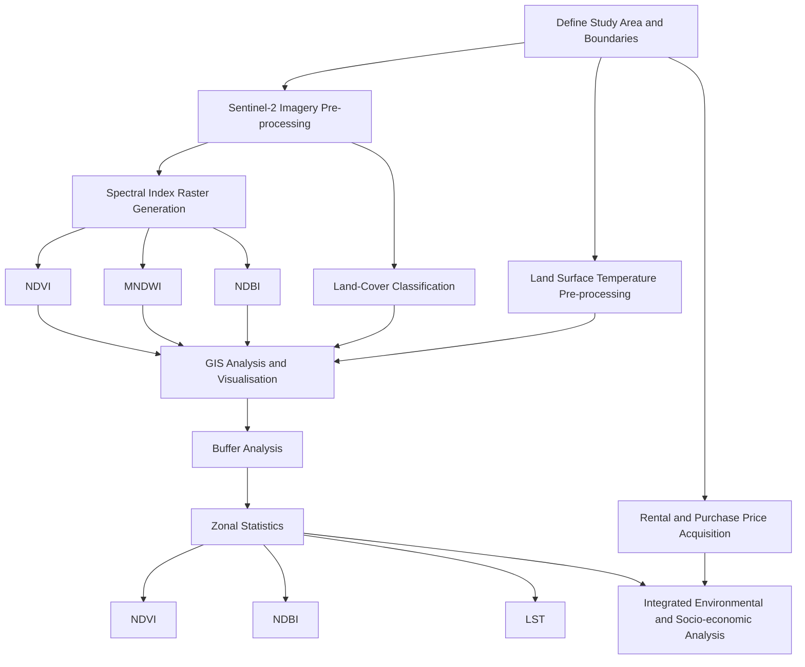

```mermaid
flowchart TD
    A[Define Study Area and Boundaries] --> B[Sentinel-2 Imagery Pre-processing]

    B --> C[Spectral Index Raster Generation]
    C --> C1[NDVI]
    C --> C2[MNDWI]
    C --> C3[NDBI]

    A --> D[Land Surface Temperature Pre-processing]

    B --> E[Land-Cover Classification]

    C1 --> F[GIS Analysis and Visualisation]
    C2 --> F
    C3 --> F
    D --> F
    E --> F

    F --> G[Buffer Analysis]

    G --> H[Zonal Statistics]
    H --> H1[NDVI]
    H --> H2[NDBI]
    H --> H3[LST]

    A --> I[Rental and Purchase Price Acquisition]

    H --> J[Integrated Environmental and Socio-economic Analysis]
    I --> J
```

# References:
